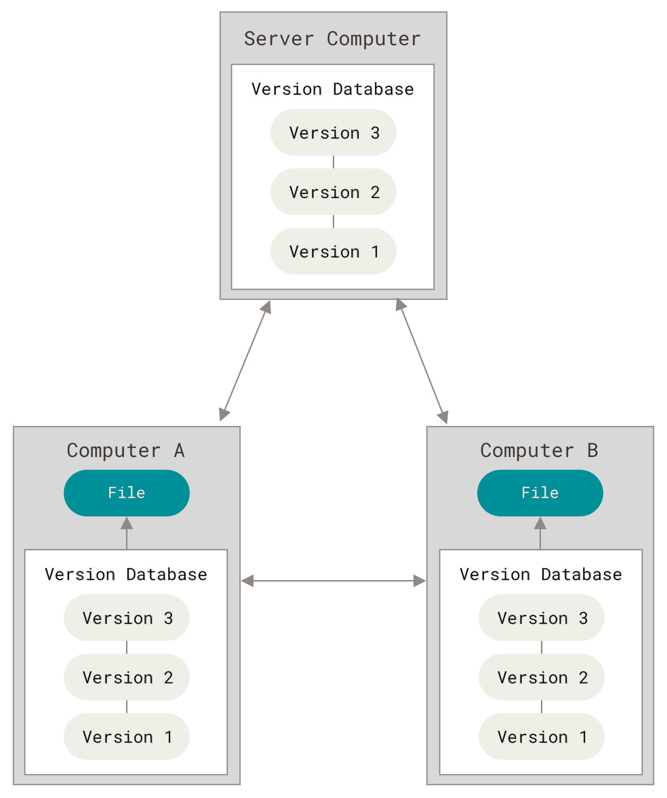

t_mf.made
title: "Meeting 03"
format:
    html:
        toc: true
        toc-depth: 3
        code-fold: true
        link-external-newwindow: true
        code-overflow: wrap
        code-copy: true
# pdf output disabled for GitHub Pages build (no TeX on CI)
date: "2026-02-11"
date-modified: "2026-02-11"
author: "Kwok-leong Tang"
---

# Today's Schedule

- A little bit about version control
- Return to the terminal
- Let’s try Openwork
- In-class exercise (Terminal + Codespaces + Pull Request)

# Return to the terminal

## What is the terminal?

:::{.callout-important}
A terminal is a text-based interface for your computer.
::: 

Think of it as a conversation window. Instead of clicking icons (which is like pointing at things on a menu), you type commands (like speaking to a waiter) to tell the computer exactly what to do.

# A little bit about version control

## Package Managers

Homebrew and Winget are package managers designed to simplify the installation, update, and management of software on macOS and Windows systems, respectively. They streamline the process of handling software packages, making it more efficient for users to maintain their systems.

### Homebrew (macOS)

[Homebrew](https://brew.sh/) is a package manager for macOS (and Linux) that allows users to install and manage free and open-source software via the command line. It’s particularly favored by developers for its simplicity and the vast array of packages available.

#### Installation on macOS:

1. **Open Terminal**: You can find Terminal in the Utilities folder within your Applications, or by searching for it using Spotlight (press Command + Space and type “Terminal”).
2. **Install Xcode Command Line Tools**: Before installing Homebrew, ensure that you have the necessary command line tools. Execute the following command:
```{.bash}
xcode-select --install
```
3. **Install Homebrew**: Once you have Xcode Command Line Tools installed, run the following command to install Homebrew:
```{.bash}
/bin/bash -c "$(curl -fsSL https://raw.githubusercontent.com/Homebrew/install/HEAD/install.sh)"
```
This script will download and install Homebrew on your system. Follow the on-screen instructions during the installation process.

4. **Verify Installation**: After installation, confirm that Homebrew is correctly installed by running:
```{.bash}
brew --version
```
This command should display the version number of Homebrew.

#### Basic Homebrew Commands

1. **Install a Package**: To install a package, use the `brew install` command followed by the package name.
```{.bash}
brew install <package_name>
```
2. **Update Homebrew**: To update Homebrew itself, use the `brew update` command.
```{.bash}
brew update
```
3. **List Installed Packages**: To list all installed packages, use the `brew list` command.
```{.bash}
brew list
```
4. **Uninstall a Package**: To uninstall a package, use the `brew uninstall` command followed by the package name.
```{.bash}
brew uninstall <package_name>
```
5. **Upgrade a Package**: To upgrade a package, use the `brew upgrade` command followed by the package name.
```{.bash}  
brew upgrade <package_name> 
```
### Winget (Windows)

Winget, or the Windows Package Manager, is a command-line tool for Windows 10 and Windows 11 that enables users to discover, install, upgrade, remove, and configure applications. It serves as a convenient method to manage software installations on Windows systems.

#### Installation on Windows:

Winget comes pre-installed on Windows 11 and modern versions of Windows 10 as part of the App Installer. To verify if Winget is installed, open the Command Prompt or PowerShell and type:

```{.powershell}
winget  --version  
```

If Winget is installed, this command will display the version number. If it’s not installed, you can download the App Installer from the Microsoft Store.

#### Using Winget

1. **Open PowerShell**: Open the Windows PowerShell console by right-clicking on the Start button and selecting "PowerShell".

2. **Search for a Package**: To search for a specific application:
```{.powershell}
winget search <package_name>
```
3. **Install a Package**: To install a package, use the `winget install` command followed by the package name.
```{.powershell}
winget install <package_name>
```
4. **Uninstall a Package**: To uninstall a package, use the `winget uninstall` command followed by the package name.
```{.powershell}
winget uninstall <package_name>
```
5. **Upgrade a Package**: To upgrade a package, use the `winget upgrade` command followed by the package name.
```{.powershell}
winget upgrade <package_name> 
```

## Shortcut

- Open Antigravity.
- In the extension settings, search for "Topcoder Fullstack" and install it.
- 

## What is Version Control?

- Version control is a system for tracking changes to files over time.  
- It lets you **save snapshots** of your work, revert to earlier versions, and track who made which changes.  
- Think of it like the **track changes** feature in Word or Google Docs, but more powerful and for all kinds of files.  
- **Why it matters:** No more files named "Essay_final_v5_FINAL.docx" – version control keeps a *history* so you always have every version.

```{mermaid}
flowchart LR
    v1["File Version 1"] --> v2["File Version 2"] --> v3["File Version 3"]
```

## What is Git?

- Git is the most widely used version control tool (VCS) in the world.
- It runs on your computer to track changes in a project (a local repository).
- Git lets you record commits (snapshots of your files) and then sync with a remote server (e.g., GitHub) to share those changes.
- You can experiment on separate branches without affecting the main project, then merge your work when it’s ready.

```{mermaid}
flowchart LR
    WD[Working Directory] -->|git add| Index[Staging Area] -->|git commit| Repo[Local Repository]
    Repo -->|git push| Remote[GitHub Repository]
```


(Image source: [Git](https://git-scm.com/book/en/v2/Getting-Started-About-Version-Control))

In most of the cases, the "Server Computer" is the code repositories. In our case, it is GitHub. 

### Install Git and GitHub

#### Homebrew

1. Open Terminal
2. Run the following command to install Homebrew:
```{.bash}
brew install git
```
3. Try the following command to check if Git is installed:
```{.bash}
git --version
```
4. Run the following command to install GitHub CLI:
```{.bash}
brew install gh
```
5. Try the following command to check if GitHub CLI is installed:
```{.bash}
gh --version
```

#### Winget

1. Open PowerShell
2. Run the following command to install Git:
```{.powershell}    
winget install --id Git.Git
```
1. Try the following command to check if Git is installed:
```{.powershell}
git --version
``` 
1. Run the following command to install GitHub CLI:
```{.powershell}    
winget install --id GitHub.cli
```
1. Try the following command to check if GitHub CLI is installed:
```{.powershell}
gh --version
```

### How to Register a GitHub Account?
- Go to [GitHub.com](https://github.com) and click Sign Up.
- Choose a username (this will be your handle on GitHub).
- Enter your email (use your Harvard email or EDU email if you want to use the Education benefits) and create a password.
- Verify your account via the email sent by GitHub.
-Choose the free plan (it’s sufficient for almost all academic projects).
- Tip: You can skip creating a repository during sign-up – we’ll do that ourselves. 

## What is Quarto?

Quarto is an open-source scientific and technical publishing system. It:

- Uses a .qmd (Quarto Markdown) file to combine text, code, and outputs.
- Can render to multiple formats (HTML, PDF, Word, reveal.js slides, etc.).
- Supports Python, R, Julia, and more.
- Ideal for reproducible documents, such as articles, presentations, or data analyses.

### Install the Quarto CLI

Using the official installer:

1.	Download Installer: Visit the [Quarto Downloads page](https://quarto.org/docs/download/) and download the installer for your OS.
2.	Run Installer.
3.	Verify Installation: Open Terminal and run:
```{.bash}    
quarto --version
```

### Install the Quarto extension for Antigravity

1. Open Antigravity.
2. Click the "Extensions" button on the left sidebar.
3. Search for "Quarto" and click "Install".

### Structure of a .qmd File
A .qmd (Quarto Markdown) file typically has:
1.	YAML Header (between --- lines):
```{.yaml}
---
title: "Document Title"
author: "Your Name"
format: html
---
```
2.	Body Content in Markdown:
```{.markdown}
# Introduction

This is normal text written in Markdown.
```

When you run:
```{.bash}
quarto render your_file.qmd
```
Quarto processes the .qmd file and produces the output format(s) you specified (e.g., .html, .pdf, etc.).

## Practice: Creating a Quarto Document and Pushing to GitHub

This guide will walk you through the process of creating a folder, initializing a Git repository, creating a Quarto (`.qmd`) file, making initial commits, revising the file, and pushing the changes to a remote repository on GitHub.

**Prerequisites**:

- **Git**: Ensure Git is installed on your system. Verify by running `git --version` in your terminal.
- **Quarto**: Ensure Quarto is installed. Verify by running `quarto --version` in your terminal.
- **GitHub Account**: Ensure you have an account on [GitHub](https://github.com).

**Instructions**:

1. **Create a Folder**:
   - Open your terminal or command prompt.
   - Navigate to your desired parent directory using the `cd` command.
   - Create a new folder named `my_project`:
     ```bash
     mkdir my_project
     ```
   - Navigate into the newly created folder:
     ```bash
     cd my_project
     ```

2. **Initialize a Git Repository**:
   - Initialize an empty Git repository in the current directory:
     ```bash
     git init
     ```
   - This command creates a `.git` subdirectory, setting up the necessary files and structures for version control.

3. **Create a Quarto (`.qmd`) File**:
   - Open your preferred text editor (e.g., Visual Studio Code).
   - Create a new file named `document.qmd` with the following content:
     ```markdown
     ---
     title: "My First Quarto Document"
     author: "Your Name"
     date: "2025-02-11"
     format: html
     ---

     # Introduction

     This is my first Quarto document.
     ```
   - Save the file in the `my_project` directory.

4. **Make the First Commit**:
   - In the terminal, ensure you're in the `my_project` directory.
   - Stage the new file for commit:
     ```bash
     git add document.qmd
     ```
   - Commit the staged file with a descriptive message:
     ```bash
     git commit -m "Add initial Quarto document"
     ```

5. **Revise the `.qmd` File**:
   - Open `document.qmd` in your text editor.
   - Add a new section:
     ```markdown
     # Conclusion

     This concludes my first Quarto document.
     ```
   - Save the changes.

6. **Make a Second Commit**:
   - Stage the modified file:
     ```bash
     git add document.qmd
     ```
   - Commit the changes with an appropriate message:
     ```bash
     git commit -m "Add conclusion section to Quarto document"
     ```

7. **Push to a Remote Repository on GitHub**:
   - **Create a Remote Repository**:
     - Log in to your GitHub account.
     - Click the **"+"** icon in the top-right corner and select **"New repository"**.
     - Name the repository `my_project` and choose its visibility (public or private).
     - Click **"Create repository"**.
   - **Connect Local Repository to GitHub**:
     - In the terminal, add the remote repository:
       ```bash
       git remote add origin https://github.com/your-username/my_project.git
       ```
       Replace `your-username` with your GitHub username.
   - **Push Local Changes to GitHub**:
     - Push your commits to the remote repository:
       ```bash
       git push -u origin main
       ```
       If your local branch is named `master`, replace `main` with `master`.

**Notes**:

- The `git add` command stages changes, preparing them for a commit.
- The `git commit` command records the staged changes in the repository's history.
- The `git push` command uploads local repository content to a remote repository.

By following these steps, you've successfully created a project, tracked its versions using Git, and published it to GitHub.

## In-class exercise (Terminal + Codespaces + Pull Request)

Please complete the in-class exercise here:

- [In-class Exercise (Meeting 03)](../meetings/in-class-exercise-meeting-03.qmd)

# Let's try Openwork

In order to start using agentic approach for your research as soon as possible, we will use Openwork, an easy-to-use version of OpenCode. We will use Openwork to build a research workflow agent.

- Download Openwork from [Openwork](https://openwork.software).
- The "Big Pickle" model in Openwork is free for limited time use. It is the GLM-4.6 model from [Z.ai](https://z.ai).

## References

- [Homebrew for MacOS](https://brew.sh/)
- [Winget for Windows](https://learn.microsoft.com/en-us/windows/wsl/install) 
- [Git Documentation](https://git-scm.com/book/en/v2/)
- [GitHub Documentation](https://docs.github.com)
- [Quarto Documentation](https://quarto.org/docs/get-started/)
- [Openwork Documentation](https://openwork.software)